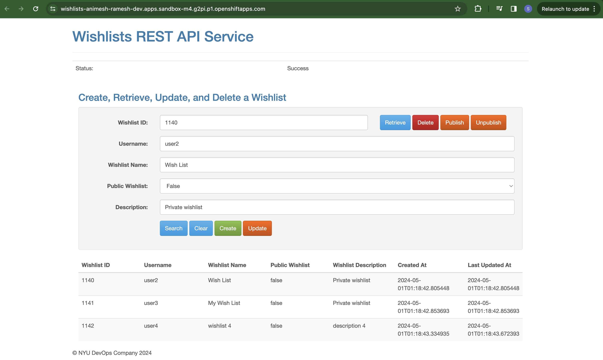
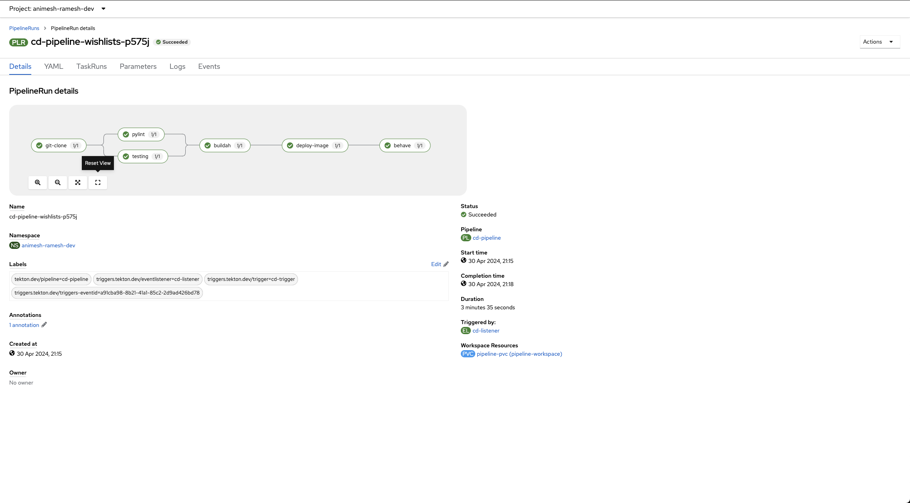
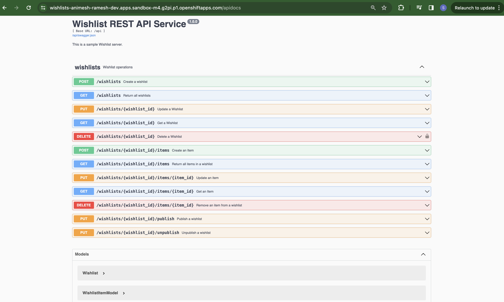

# Wishlists Service

[](https://opensource.org/licenses/Apache-2.0)
[](https://python.org/)
[](https://github.com/CSCI-GA-2820-SP24-003/wishlists/actions)
[](https://github.com/CSCI-GA-2820-SP24-003/wishlists/actions)
[](https://codecov.io/gh/CSCI-GA-2820-SP24-003/wishlists)


## Overview

This project involves designing, developing, and deploying wishlists and the associated wishlist items. We include models, routes, and tests to facilitate CRUD (create, read, update, delete) operations as well as the ability to list items by executing RESTful API requests coded in Flask. We strictly kept DevOps practices in mind, emphasizing automation, continuous integration, and providing a clear, comprehensive test suite to ensure code quality and reliability.

**Tip: For a streamlined development experience, open the project in DevContainers with VSCode.** 

## CD Deployment
For deployment the docker image must be stored in the registry. Currently, the deployment build uses wishlist:latest tag. Follow these steps to successfully deploy wishlists application on your k8s cluster.

```
make cluster
docker build -t wishlists:1.0 .
docker tag wishlists:1.0 cluster-registry:32000/wishlists:1.0
sudo sh -c "echo '127.0.0.1  cluster-registry' >> /etc/hosts"
docker push cluster-registry:32000/wishlists:1.0
kc apply -f k8s
kc get all
```

After you do this all of the pods might take a while to run.
After it is up check localhost:8080 our UI should come up.

## Come and take a look at our Wishlist App!

### Wishlist APP
[Click here to check it out!](https://wishlists-animesh-ramesh-dev.apps.sandbox-m4.g2pi.p1.openshiftapps.com/)


### Pipeline Depployment


### Swagger
[Click here to check it out!](https://wishlists-animesh-ramesh-dev.apps.sandbox-m4.g2pi.p1.openshiftapps.com/apidocs)



## Directory

The project contains the following:

```text
.gitignore          - this will ignore vagrant and other metadata files
.flaskenv           - Environment variables to configure Flask
.gitattributes      - File to gix Windows CRLF issues
.devcontainers/     - Folder with support for VSCode Remote Containers
.github/workflows/  - Folder to run workflow jobs on GitHub Actions
.tekton/            - Folder to store our pipeline artifacts
dot-env-example     - copy to .env to use environment variables
pyproject.toml      - Poetry list of Python libraries required by your code

service/                   - service python package
├── __init__.py            - package initializer
├── config.py              - configuration parameters
├── models
    ├── __init__.py        - model initializer
    ├── persistent_base.py - Base class
    ├── wishlist.py        - Wishlist model
    ├── wishlist_item.py   - Wishlist Item model
├── routes.py              - module with service routes
└── common                 - common code package
    ├── cli_commands.py    - Flask command to recreate all tables
    ├── error_handlers.py  - HTTP error handling code
    ├── log_handlers.py    - logging setup code
    └── status.py          - HTTP status constants
├── static
    ├── css                - Folder containing all style sheets
    ├── images             - Folder to house all static images
    ├── js                 - Folder containing javascript files
    ├── index.html         - Wishlist UI frontend file

tests/                     - test cases package
├── __init__.py            - package initializer
├── factories.py           - test factories
├── test_cli_commands.py   - test suite for the CLI
├── test_routes.py         - test suite for service routes
├── test_wishlist_item.py  - test suite for wishlist item model
└── test_wishlist.py       - test suite for wishlist model
```

## Testing

### Unit Testing 
```bash
make test
```

### Integration Testing 
```bash
honcho start
behave
```

## License

Copyright (c) 2016, 2024 [John Rofrano](https://www.linkedin.com/in/JohnRofrano/). All rights reserved.

Licensed under the Apache License. See [LICENSE](LICENSE)

This repository is part of the New York University (NYU) masters class: **CSCI-GA.2820-001 DevOps and Agile Methodologies** created and taught by [John Rofrano](https://cs.nyu.edu/~rofrano/), Adjunct Instructor, NYU Courant Institute, Graduate Division, Computer Science, and NYU Stern School of Business.
